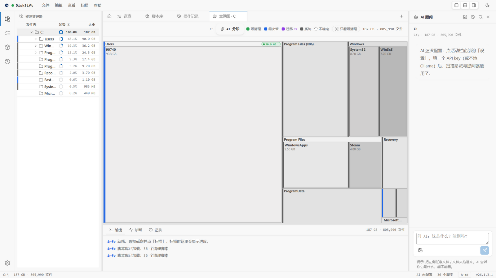
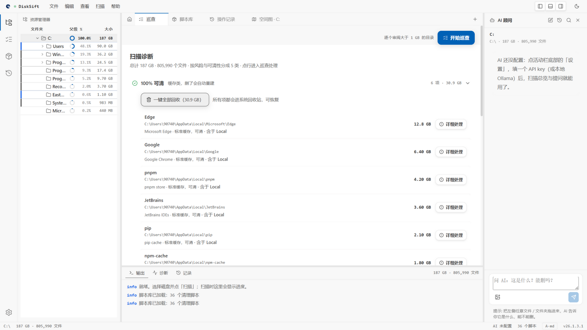
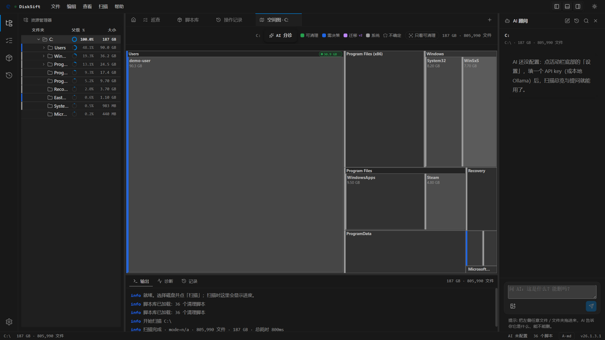

<div align="center">


# DiskSift

**Sift the cleanable out of your drive.**

Whole-drive scan in seconds · AI triage with color coding · script-based cleaning for known apps · double-layer red-line protection — everything lands in the Recycle Bin, and your file contents are never read.

[](LICENSE)
[](https://tauri.app)
[](#quick-start)
[](#quick-start)

**Download** · [Screenshots](#screenshots) · [Relation to Pinkbin](#relation-to-pinkbin) · [Four things](#four-things) · [Security model](#security-model) · [Building from source](#building-from-source)

[简体中文](README.md) | English

</div>

---

## Screenshots

<p align="center">
  
</p>

First look after scanning C:: a space treemap in the middle (blue bars = AI/rule verdicts, green pills = cleanable aggregates), the explorer tree on the left with a usage ring per row — **double-click to drill down on the map and the tree follows; pick a folder in the tree and the map re-roots**. The AI sidebar on the right answers "what is this, can I delete it" anytime.

<p align="center">
  
</p>

The scan diagnosis report sorts directories into five buckets: *safe / needs-decision / migrate / system / uncertain*. The "100% safe" bucket supports **one-click recycle** — two-step confirm, everything into the Recycle Bin, restorable.

<p align="center">
  
</p>

---

## Relation to Pinkbin

Straight up: **DiskSift is a re-distribution of [Pinkbin](https://github.com/cccyd2003-qwq/pinkbin) (MIT)**. Pinkbin laid the perfect foundation — NTFS MFT fast scan, scaffold red-line tests, undo ledger, Recycle-Bin-by-default — all inherited untouched. Thanks to the original author cccyd2003-qwq.

DiskSift does three things on top: **the frontend is rebuilt from scratch, AI evolved from Q&A into a triage system, and safety guards pushed down into the execution layer**. Side by side:

| | Pinkbin | DiskSift |
|---|---|---|
| **Workbench** | Three-pane layout | Modern IDE five-zone workbench · browser-style multi-tab · independently collapsible regions |
| **Space awareness** | Treemap / tree, independent | **Two-way synced navigation** · usage rings · breadcrumb drill-down |
| **AI** | Drag-and-drop Q&A | **Five-verdict triage layer**: batch triage · full-map coloring · focus-on-cleanable · aggregate badges · AI-drafted scripts (red-line gated) |
| **Cleaning scripts** | 2 (WeChat/Conda) | **36** + script center (enable/disable · TOML import/export with red-line checks) |
| **Automation** | — | Scheduled auto-patrol (Windows Task Scheduler, headless, safe-only) |
| **Anti-misdelete** | UI-layer protected list | **Frontend + Rust executor double-layer fail-closed** |
| **Undo** | undo.jsonl | + day-grouped undo center · visual restore |
| **Keys** | Plain-text localStorage | Windows **DPAPI encryption** |

Versioning is its own lineage: `YY.breaking+1.feature+1.patch+1`, currently **v26.1.3.1** ([VERSIONING.md](VERSIONING.md)).

---

## Four things

### 1. Fast scan, linked map and tree

Direct NTFS Master File Table reads (the `ntfs` crate), a full C: drive in **2–5 seconds**; jwalk fallback elsewhere. Treemap click for the detail card, double-click to drill down, breadcrumb to go back — the tree is fully keyboard accessible.

### 2. AI triage

Batch-triage a whole drive or drag a single folder to ask. The AI only receives **directory metadata** (paths, sizes, file counts, extension shares, ≤20 sample paths) — **file contents are never read**. BYOK across Anthropic / OpenAI / Gemini / Ollama, with a free onboarding guide: local Ollama · GLM-4-Flash · SiliconFlow free tier. Endpoints that reject `response_format` get an automatic fallback retry.

### 3. Script center

36 built-in scripts covering browsers, dev toolchains, IM apps, cloud drives and game platforms. Each script = a TOML manifest + **red-line integration tests** (chat DBs, accounts, favorites never enter the cleaning surface). For cleanable folders without a script, the AI drafts one through a trimmed 14-phase flow and the red-line check must pass before it can be saved.

### 4. Scheduled auto-patrol

A Windows Task Scheduler job runs headless: touches only the "safe" bucket, moves things into the Recycle Bin, writes the ledger, exits. Hourly / daily / weekly / monthly.

---

## Security model

Trust lives in the guardrails. Five layers:

| Layer | Mechanism |
|---|---|
| **Manifest** | Every script ships two assertions: positive (targets are hit) + red-line (chat DBs / accounts / favorites are never hit), CI-enforced |
| **Engine** | NEVER_TOUCH protected list (Windows / Program Files / Recovery / user documents…) matched on segment boundaries — `C:\Windows` hits, `C:\WindowsExcl` does not |
| **Executor** | The Rust executor re-runs the protected check per plan and rejects the **whole plan fail-closed** — even a buggy UI cannot execute it |
| **Action** | System Recycle Bin by default (restorable); two-step confirm for bulk actions; optional quarantine retention |
| **Ledger** | Every action lands in `undo.jsonl`; the undo center groups by day and restores in one click |

Account scoping is fail-closed too: unchecking every account in the cleaning dialog **rejects the whole run**. API keys are DPAPI-encrypted on-device.

---

## Quick start

1. Grab `DiskSift_x.x.x_x64-setup.exe` (or MSI) from [Releases](https://github.com/zep4yrs/DiskSift/releases/latest). SmartScreen: "More info → Run anyway". The manifest auto-elevates for MFT reads
2. **⚙ at the bottom of the activity bar** to configure AI — or follow the free-model guide (rule-based triage works without a key)
3. Pick a drive on the home page → **Scan**
4. Explore the map; run "AI triage" for batch coloring; clean by bucket in the patrol page; restore mistakes from the records page

> Mirror for mainland China: [CNB repository](https://cnb.cool/feng-qiao/DiskSift).

---

## Building from source

```bash
git clone https://github.com/zep4yrs/DiskSift.git && cd DiskSift
pnpm install
pnpm tauri dev            # desktop app (first Rust build takes 5-15 min)
pnpm -C apps/desktop dev  # frontend only, browser debugging, mocked backend
cargo test --workspace        # Rust workspace tests
pnpm -C apps/desktop test # frontend engine tests
```

Requires **Node 20+ · pnpm 9+ · Rust stable · Tauri prerequisites** (VS Build Tools 2022 + WebView2 on Windows).

---

## Roadmap

- [ ] **v26.1.4.0** Real-time monitoring via USN Journal
- [ ] **v26.1.5.0** Cross-platform installer matrix (after signing + real-machine verification)
- [ ] One-click "migrate" to another drive
- [ ] macOS signing certificate

---

## Acknowledgments

DiskSift stands on the shoulders of [Pinkbin](https://github.com/cccyd2003-qwq/pinkbin) — the security architecture and the original implementation are entirely inherited from it.

Inspiration: [WizTree](https://diskanalyzer.com) · [SpaceSniffer](http://www.uderzo.it/main_products/space_sniffer/) · [CleanMyWechat](https://github.com/blackboxo/CleanMyWechat) · [SquirrelDisk](https://github.com/adileo/squirreldisk)

Shoulders: [Tauri](https://tauri.app) · [d3-hierarchy](https://github.com/d3/d3-hierarchy) · [jwalk](https://github.com/jessegrosjean/jwalk) · [ntfs](https://github.com/ColinFinck/ntfs) · [globset](https://github.com/BurntSushi/ripgrep/tree/master/crates/globset) · [trash-rs](https://github.com/Byron/trash-rs) · [react-markdown](https://github.com/remarkjs/react-markdown) · [Lucide](https://lucide.dev)

Collaboration: [@jtlyu](https://github.com/jtlyu) (upstream performance work + WeChat 4.x rewrite + scaffold harness infrastructure)

---

## License

**GPL-3.0-or-later** — free to use, study, modify and redistribute; commercial use requires derivatives to be **licensed under GPL-3.0 as well**. Closed-source derivatives are not permitted.

This distribution includes code from [Pinkbin](https://github.com/cccyd2003-qwq/pinkbin) (MIT); the upstream copyright and MIT notice are preserved verbatim in [LICENSE](LICENSE). If you modify a scaffold, keep its safety test in sync — the red-line assertions are the last line of defense against accidentally deleting user data.
